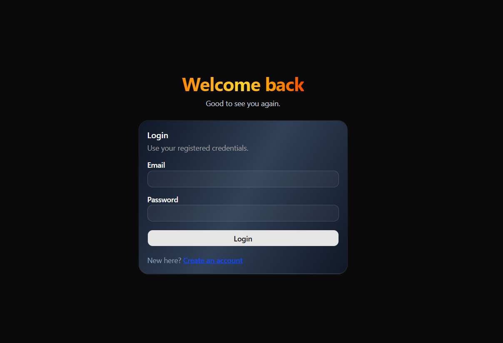
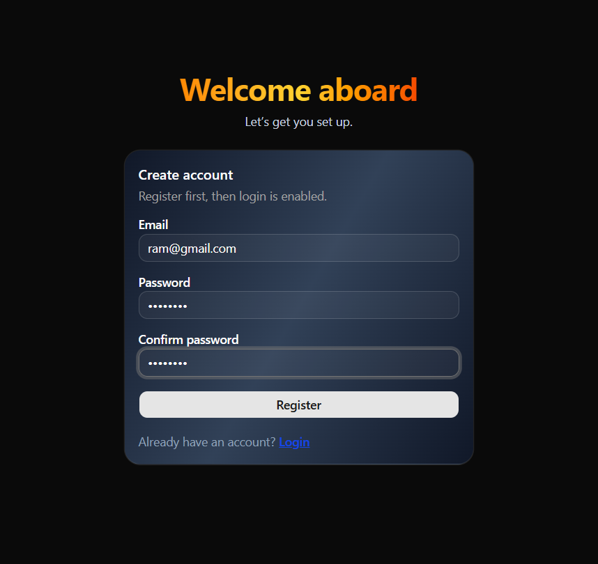
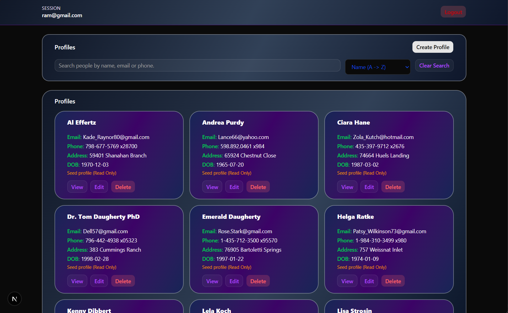

# 🚀 Frontend Authentication & User Dashboard

This repository includes a backend API and a Next.js frontend for authentication and profile management.

## 🛠️ Clone the repository

```bash
git clone https://github.com/BinitAcharya7/frontend-task.git
cd frontend-task
```

## ⚙️ Installation & Setup

Install dependencies and start the API server:

```bash
npm install
npm run dev
```

Backend base URL: `http://localhost:5000`  
Swagger docs: `http://localhost:5000/api-docs`

### 2) Frontend setup (`/frontend`)

Install dependencies and start the frontend:

```bash
cd frontend
npm install
npm run dev
```

Frontend URL: `http://localhost:3000`

---

## 🔐 Authentication flow

1. Register first
2. Login with the same credentials
3. Access token and refresh token are stored in `localStorage`
4. Protected routes redirect unauthenticated users to `/login`

---

## 📄 Pages and features

- **Register** (`/register`)
  - react-hook-form validation
  - auto-login on successful registration

- **Login** (`/login`)
  - react-hook-form validation
  - stores auth session on success

- **Home** (`/`)
  - protected route
  - profile listing with search + pagination
  - create profile (modal)
  - view profile details
  - edit profile with prefilled values
  - delete profile with confirmation

---

## 📡 API endpoints used by frontend

- `POST /api/auth/register`
- `POST /api/auth/login`
- `POST /api/auth/refresh`
- `POST /api/auth/logout`
- `GET /api/profiles`
- `GET /api/profiles/{id}`
- `POST /api/profiles`
- `PUT /api/profiles/{id}`
- `DELETE /api/profiles/{id}`

Auth header for protected endpoints:

```bash
Authorization: Bearer <accessToken>
```

---

## 🧪 Final QA checklist

- Register with a new account
- Logout and login with same account
- Verify protected route redirect behavior
- Search profiles and paginate results
- Create a profile from modal
- View, edit, and delete a newly created profile
- Run lint and build before submission

```bash
cd frontend
npm run lint
npm run build
```

---

## 🖼️ Screenshots

- **Login**: User sign-in form with validation.



- **Register**: New account creation form.



- **Home**: Protected dashboard with profile list and actions.



---

## 🙌 Acknowledgement

This project was completed as part of a frontend technical assignment.
